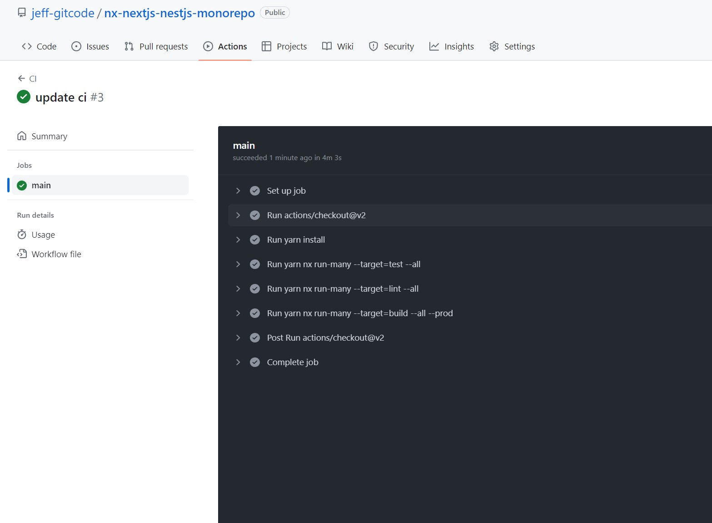
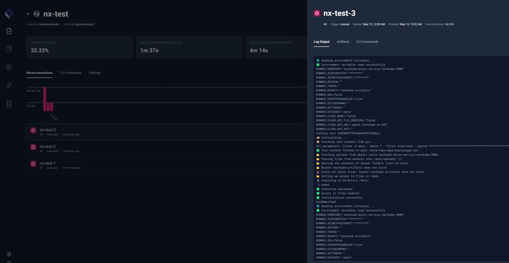
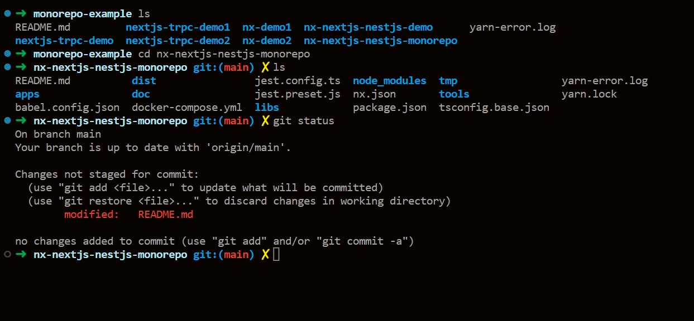

# NxNextjsNestjsMonorepo

# nx-nextjs-nestjs example

## Tech Stack
- [x] nextjs
- [x] nestjs
- [x] expressjs
- [x] nx monorepo
- [x] cypress/storybook
- [x] styled-component
- [x] docker/docker-compose
- [x] husky
- [ ] dev container
- [x] github actions (CI/CD)
- [x] minikube
- [x] testkube
- [x] zsh

````javascript

$ npm install nx -g

$ npx create-nx-workspace@latest nx-nextjs-nestjs-monorepo --package-manager=yarn

✔ Choose what to create                 · integrated
✔ What to create in the new workspace   · next
✔ Application name                      · nextapp
✔ Default stylesheet format             · styled-components
✔ Enable distributed caching to make your CI faster · No

# cypress
$ apt-get install libgtk2.0-0 libgtk-3-0 libgbm-dev libnotify-dev libgconf-2-4 libnss3 libxss1 libasound2 libxtst6 xauth xvfb

# storybook
$ yarn add -D @nx/storybook

# express
$ yarn add --dev @nx/express

$ nx g @nx/express:app expressapp

# angular
$ yarn add -D @nx/angular

$ nx g @nx/angular:app angularapp

# node
$ yarn add -D @nx/node

$ nx g @nx/node:application nodeapp
>  NX  Generating @nx/node:application
✔ Which framework do you want to use? · express

# react
$ yarn add -D @nx/react

$ nx g @nx/react:app reactapp

$ nx g @nx/react:storybook-configuration reactapp

# remove project
$ nx g rm projectname

# husky
$ npx husky-init

# nx container
$ yarn add -D @nx-tools/nx-container

# add .github/workflows/ci.yml

# kubernetes
# install kubectl
$ curl -LO "https://dl.k8s.io/release/$(curl -L -s https://dl.k8s.io/release/stable.txt)/bin/linux/amd64/kubectl"

# verify binary
$ curl -LO "https://dl.k8s.io/$(curl -L -s https://dl.k8s.io/release/stable.txt)/bin/linux/amd64/kubectl.sha256"

$ echo "$(cat kubectl.sha256)  kubectl" | sha256sum --check

$ sudo install -o root -g root -m 0755 kubectl /usr/local/bin/kubectl

$ kubectl version --client

# install minikube
$ curl -LO https://storage.googleapis.com/minikube/releases/latest/minikube-linux-amd64

$ sudo install minikube-linux-amd64 /usr/local/bin/minikube

$ minikube version

# install docker
$ curl -fsSL https://get.docker.com -o get-docker.sh

$ sudo sh get-docker.sh

$ docker --version

# install docker-compose
$ sudo apt install docker-compose

$ docker-compose --version

# install docker-desktop
$ sudo apt install gnome-terminal

# run minikube
# start k8s
$ minikube start

# Check if minikube node is ready
$ kubectl get nodes

# docker build
$ yarn build:all

# config
$ minikube docker-env 
$ eval $(minikube -p minikube docker-env)

# build docker
$ docker build -f ./apps/expressapp/Dockerfile . -t expressapp

$ docker images --format "table {{.ID}}\t{{.Tag}}\t{{.Repository}}"

# deploy
$ kubectl apply -f apps/expressapp/deployment.json 
$ kubectl apply -f apps/expressapp/service.json 

$ kubectl get pods
$ kubectl get services

$ minikube service expressapp-service --url

$ minikube dashboard

# helm
$ curl -fsSL -o get_helm.sh https://raw.githubusercontent.com/helm/helm/main/scripts/get-helm-3
$ chmod 700 get_helm.sh
$ ./get_helm.sh

# testkube
# install
$ wget -qO - https://repo.testkube.io/key.pub | sudo apt-key add - && echo "deb https://repo.testkube.io/linux linux main" | sudo tee -a /etc/apt/sources.list && sudo apt-get update && sudo apt-get install -y testkube

# testtube init
$ testkube init

# dashboard
$ testkube dashboard

# zsh
$ sudo apt-get update

$ sudo apt-get install zsh

$ zsh --version

$ which zsh

# ohmyzsh
$ sh -c "$(curl -fsSL https://raw.githubusercontent.com/ohmyzsh/ohmyzsh/master/tools/install.sh)"

# Press ctrl+shift+p to fire up the command box.
# Type ‘select default shell’ to filter, and and enter the Terminal-Select Default Shell .
# select zsh as default shell.
````

# Github Actions (CI/CD)


# TestKube


# ZSH


<a alt="Nx logo" href="https://nx.dev" target="_blank" rel="noreferrer"></a>

✨ **This workspace has been generated by [Nx, a Smart, fast and extensible build system.](https://nx.dev)** ✨

## Development server

Run `nx serve nextapp` for a dev server. Navigate to http://localhost:4200/. The app will automatically reload if you change any of the source files.

## Understand this workspace

Run `nx graph` to see a diagram of the dependencies of the projects.

## Remote caching

Run `npx nx connect-to-nx-cloud` to enable [remote caching](https://nx.app) and make CI faster.

## Further help

Visit the [Nx Documentation](https://nx.dev) to learn more.
